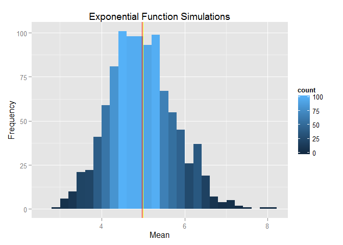
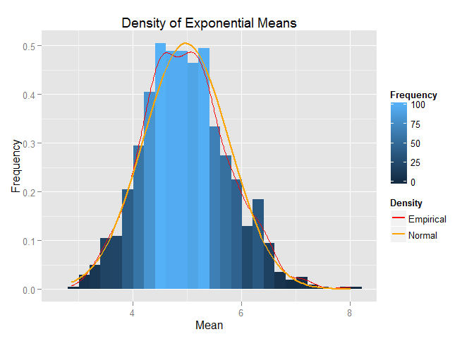
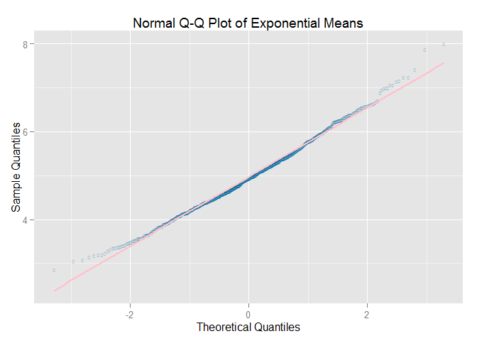

# Statistical Inference Course Project, Part 1
Eddo W. Hintoso  


****

### Simulate the data
The exponential distribution can be simulated in R with `rexp(n, lambda)` where `lambda` is the rate parameter. The mean of exponential distribution is `1 / lambda` and the standard deviation is also also `1 / lambda`. Set `lambda = 0.2` for all of the simulations. In this simulation, the distribution of averages of 40 exponentials will be investigated. Note that a thousand or so simulated averages of 40 exponentials are needed.

```r
##  set seed for reproducability
set.seed(13)

##  set lambda to 0.2
lambda <- 0.2

##  40 samples
n <- 40

##  1000 simulations
nsim <- 1000

##  simulate
simulatedExponentials <- replicate(nsim, rexp(n, lambda))

##  calculate mean of exponentials
meansExponentials <- apply(simulatedExponentials, 2, mean)
```

****

### Show the sample mean and compare it to the theoretical mean of the distribution.

```r
##  distrribution mean
analyticalMean <- mean(meansExponentials)

##  analytical mean
theoreticalMean <- 1 / lambda

##  display results
c("Analytical Mean" = analyticalMean,
  "Theoretical Mean" = theoreticalMean)
```

```
##  Analytical Mean Theoretical Mean 
##         4.972512         5.000000
```

```r
##  visualization
library(ggplot2)
ggplot(data = NULL, aes(x = meansExponentials)) +
    geom_histogram(aes(fill = ..count..), binwidth = max(meansExponentials) / n) +
    geom_vline(x = c(analyticalMean,theoreticalMean), col = c("red", "yellow"), show_guide = TRUE) +
    labs(x = "Mean", y = "Frequency") +
    ggtitle("Exponential Function Simulations")
```

 

The red vertical line represents the analytical mean at **4.9725119**, while the yellow vertical line represents the theoretical mean at **5**. As one can see, the difference between these two means is very small (**0.0274881**).

****

### Show how variable the sample is (via variance) and compare it to the theoretical variance of the distribution.

```r
##  standard deviation and variance of distribution
sdDist <- sd(meansExponentials)
varDist <- sdDist ** 2

##  theoretical standard deviation and variation
sdTheoretical <- (1 / lambda) / sqrt(n)
varTheoretical <- sdTheoretical ** 2

##  display
c("Theoretical Standard Deviation" = sdTheoretical,
  "Simulated Standard Deviation" = sdDist,
  "Theoretical Variance" = varTheoretical,
  "Simulated Variance" = varDist)
```

```
## Theoretical Standard Deviation   Simulated Standard Deviation 
##                      0.7905694                      0.7894092 
##           Theoretical Variance             Simulated Variance 
##                      0.6250000                      0.6231669
```

Standard Deviation of the distribution is **0.7894092** with the theoretical SD calculated as **0.7905694**. The theoretical variance is calculated as $(\frac{1}{\lambda \sqrt{n}})^2 =$ **0.625**. The actual variance of the distribution is **0.6231669**.

****

### Show that the distribution is approximately normal.

```r
##  compare empirical distribution with normal distribution
qplot(meansExponentials, geom = 'blank') +
    geom_histogram(aes(fill = ..count.., y = ..density..), binwidth = max(meansExponentials) / n) + 
    scale_fill_gradient("Frequency") + 
    geom_line(aes(y = ..density.., color = 'Empirical'), stat = 'density', size = 0.5) + 
    stat_function(fun = dnorm, args = list(mean = analyticalMean, sd = sdDist), aes(color = "Normal"), size = 1) +
    scale_colour_manual(name = 'Density', values = c('red', 'orange')) + 
    labs(x = "Mean", y = "Frequency") +
    ggtitle("Density of Exponential Means")
```

 

```r
##  data for qqplot
q <- qqnorm(meansExponentials, plot = FALSE)

##  compare the distribution of averages of 40 exponentials to a normal distribution
ggplot(data = NULL, aes(sample = meansExponentials)) +
    stat_qq(alpha = 0.3, color = "#006699", shape = "circle") +
    geom_smooth(aes(x = q$x, y = q$y), color = "pink", size = 1, method = lm) + 
    labs(x = "Theoretical Quantiles", y = "Sample Quantiles") +
    ggtitle("Normal Q-Q Plot of Exponential Means")
```

 

Due to the central limit theorem (CLT), the distribution of averages of 40 exponentials is very close to a normal distribution.
