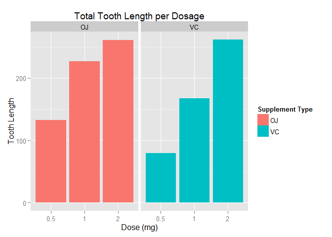

# Statistical Inference Course Project, Part 2
Eddo W. Hintoso  


****

### Synopsis

In the second part of the project, we analyze the `ToothGrowth` data in the `datasets` package. The documentation can be accessed through `help("ToothGrowth")`. The data is set of 60 observations, with the response as the l length of odontoblasts (teeth) in each of 10 guinea pigs at each of three dose levels of Vitamin C (0.5, 1 and 2 mg) with each of two delivery methods (orange juice or ascorbic acid).

```r
##  load necessary packages
library(datasets)
library(ggplot2)

##  summary
summary(ToothGrowth)
```

```
##       len        supp         dose      
##  Min.   : 4.20   OJ:30   Min.   :0.500  
##  1st Qu.:13.07   VC:30   1st Qu.:0.500  
##  Median :19.25           Median :1.000  
##  Mean   :18.81           Mean   :1.167  
##  3rd Qu.:25.27           3rd Qu.:2.000  
##  Max.   :33.90           Max.   :2.000
```

### Summary

```r
##  plot bar graphs
ggplot(data = ToothGrowth, aes(x = as.factor(dose), y = len, fill = supp)) +
    geom_bar(stat="identity") +
    facet_grid(. ~ supp) +
    guides(fill = guide_legend(title="Supplement Type")) +
    labs(x = "Dose (mg)",
         y = "Tooth Length",
         title = "Total Tooth Length per Dosage")
```

 

As can be seen above, there is a clear positive correlation between the tooth length and the dose levels of Vitamin C, for both delivery methods.

### Analysis

We know that as the dosage increases, tooth length increases as well - in other words, dosage and tooth length are positively correlated. But the more interesting question is whether the two types of supplements provide a significance difference in total tooth length, so a hypothesis test is called for. But first, the data will be split into two groups by supplements, each with 30 samples.

```r
##  subset
oj <- subset(ToothGrowth, supp == "OJ")
vc <- subset(ToothGrowth, supp == "VC")

##  sample size
nOJ <- nVC <- 30

##  means
meanOJ <- mean(oj$len)
meanVC <- mean(vc$len)

##  standard deviations
sdOJ <- sd(oj$len)
sdVC <- sd(vc$len)

##  display
c("Mean of Orange Juice" = meanOJ,
  "Mean of Ascorbic Acid" = meanVC,
  "Standard Deviation of Orange Juice" = sdOJ,
  "Standard Deviation of Ascorbic Acid" = sdVC)
```

```
##                Mean of Orange Juice               Mean of Ascorbic Acid 
##                           20.663333                           16.963333 
##  Standard Deviation of Orange Juice Standard Deviation of Ascorbic Acid 
##                            6.605561                            8.266029
```

Based on the summary above, guinea pigs fed orange juice had an average tooth length of **20.6633333** while those fed ascorbic acid had an average tooth length of **16.9633333**. There is more variability in the tooth lengths of guinea pigs fed ascorbic acid.

The queston now is, do these data provide strong evidence that the average tooth lengths of guinea pigs fed orange juice and ascorbic acid are different? For convenience, we will use a significance level of 5%.

```r
alpha <- 0.05
conf <- 1 - alpha
```

The hypothesis testing is as follows:

$H_0: \mu_{OJ} - \mu_{VC} = 0$ - Tooth length does NOT differ based on given supplements

$H_0: \mu_{OJ} - \mu_{VC} \neq 0$ - Tooth length does NOT differ based on given supplements

Now we calculate $X$, which is simply the difference between the means of the two categories, with respect to orange juice.

```r
X <- meanOJ - meanVC
```

The $\mu = 0$ since our null hypothesis is that there are no difference between tooth lengths via delivery methods.

```r
mu <- 0
```

Since our sample sizes don't exceed 30, a T-test will be considered. Thus a t-value as needed, specified by the formula

$$T = \dfrac{X - \mu}{SE}$$

where standard error is calculated as:

$$SE = \sqrt{\dfrac{SD_{OJ}^2}{n_{OJ}}+\dfrac{SD_{VC}^2}{n_{VC}}}$$


```r
##  calculate standard error
stderr = function(sd1,n1,sd2,n2) {
    sqrt( (sd1 ** 2) / n1 + (sd2 ** 2) / n2 )
}
se <- stderr(sdOJ, nOJ, sdVC, nVC)

##  calculate t-value
t <- (X - mu) / se
```

Since the test is two-sided, we calculate the p-value using the following:

```r
##  degrees of freedom
df <- min(nOJ, nVC) - 1

##  p-value
p <- 2 * (1 - pt(t, df))

##  display t-value and p-value
round(c("t-value" = t, "p-value" = p), digits = 3)
```

```
## t-value p-value 
##   1.915   0.065
```

### Conclusion

Since the p-value is **0.0653671** which is greater than $0.05$ being our significance level, we FAIL to reject our $H_0$, and thus we can conclude that **the data DOES NOT provide strong enough evidence that there is a significant difference between the average tooth lengths of guinea pigs that were fed orange juice and ascorbic acid.**

We can also calculate the 95% confidence interval via the following:

```r
##  calculate z-value
z <- qt(1 - (alpha/2), df)

##  calculate interval
CI <- X + z * se * c(-1,1)

##  display CI
c("Lower Bound (2.5%)" = min(CI),
  "Upper Bound (97.5%)" = max(CI))
```

```
##  Lower Bound (2.5%) Upper Bound (97.5%) 
##          -0.2510651           7.6510651
```

This supports our conclusion that there is no significant difference of average tooth lengths between the two delivery methods, since the 95% confidence interval contains 0.
